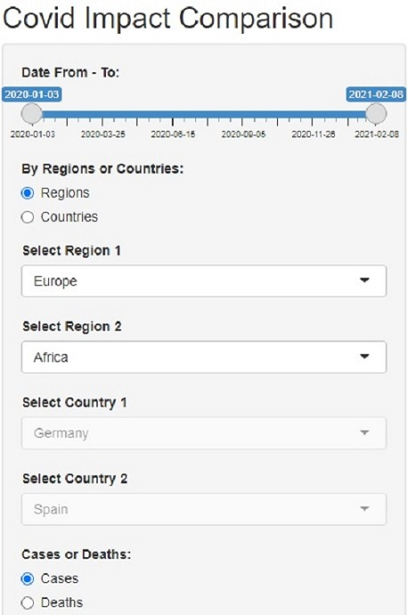
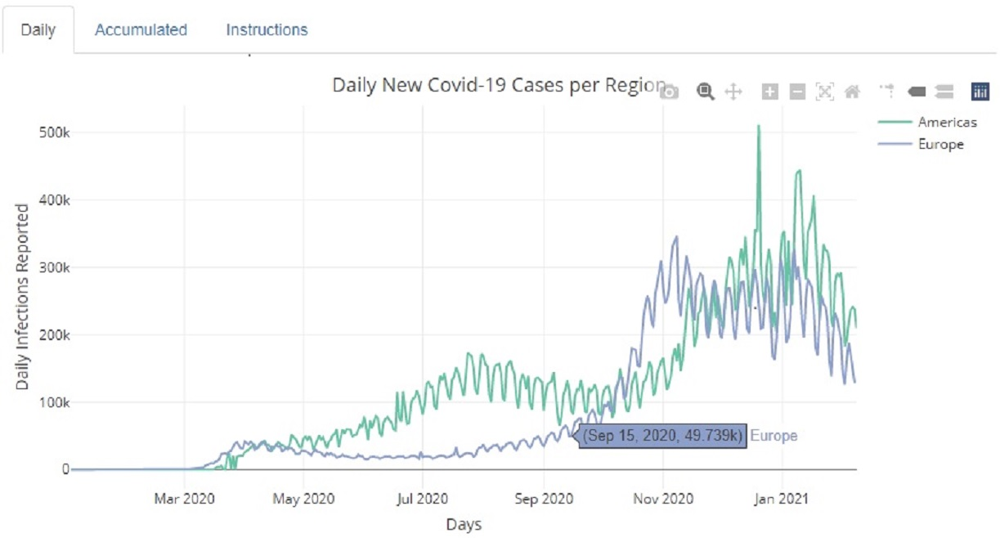

## Shiny App & Reproducible Pitch

### Course Project Objectives

1.- Create a Shiny App. This App has to have some form of input, some operations in the server with this input, and an output result of this operations. 

2.- Deploy the application on Rstudio's shiny server. **[App HERE](https://marc-arroyo.shinyapps.io/who_covid_impact/)**

3.- A reproducible pitch presentation pushed to Github or RPubs. **[Presentation HERE](https://marroyopa.github.io/DDP_Week4_Assignment/index.html)**

4.- Share the code of both, App and Presentation pitch on Github. **[Github repo HERE](https://github.com/marroyopa/DDP_Week4_Assignment/tree/gh-pages)**

### Proposed Solution 

Our proposed solution is a Shiny App to compare Covid-19 infections or deaths between two countries or two regions of the world. Data is directly loaded from the World Health Organization website.

Based on the user selections the App presents daily and accumulated graphs in Daily and Accumulated tabs. There is also an Instructions tab to guide the user.

## Origin of the information

```{r, EnvPrep, echo = FALSE, message = FALSE, warning = FALSE, error = FALSE, results='hide'}

library(shiny)
library(dplyr)
library(plotly)
library(lubridate)
library(knitr)

Sys.setlocale("LC_ALL", "English")

```

Data origin is directly the website of the World Health Organization and can be downloaded **[here](https://covid19.who.int/WHO-COVID-19-global-data.csv)**. 

This information is updated daily, that supposes up to date information, but also the file growing every day, requesting from 4 up to 25 seconds to initially be loaded, depending on server availability. 

Please, be patient, once loaded all the changes are done immediately.

Origin data is as follows:

```{r, Loaddata, echo = FALSE, message = FALSE, warning = FALSE, error = FALSE}

if(exists("whodata") == FALSE){
    address <- "https://covid19.who.int/WHO-COVID-19-global-data.csv"
    whodata <- read.csv(address, sep = ",", dec = ".")
}

str(whodata)

```

## Input Options

        - Date From - To: With a slider we select start and ending dates
        - By Regions or Countries: With a radioButton we decide if we want to compare regions or countries.
        - Region 1 / Region 2: With two selectInput directly using WHO data, we select the two regions we want to compare. If we select to compare countries will be disabled.
        - Country 1 / Country 2: With two selectInput directly using WHO data, we select the two countries we want to compare. If we select to compare regions will be disabled.
        - Cases or Deaths: With a radioButton we decide our comparison be done on reported infection cases or reported deaths.

<div style='text-align: center;'>
```{r, echo=FALSE}
   
```
</div>

## Main Panel Outputs

Three different tabs compose the Main Panel:

        - Daily: In this tab there's a Plotly interactive graph comparing daily reported data (infection cases or deaths according to user selection) between two countries, or the consolidated data reported by all the countries of two regions.
        - Accumulated: In this tab there's a Plotly interactive graph comparing accumulated reported data (infection cases or deaths according to user selection) between two countries, or the consolidated data reported by all the countries of two regions.
        - Instructions: In this tab you will find the instructions to use the App for every new user.

<div style='text-align: center;'>
```{r, echo=FALSE}
   
```    
</div>